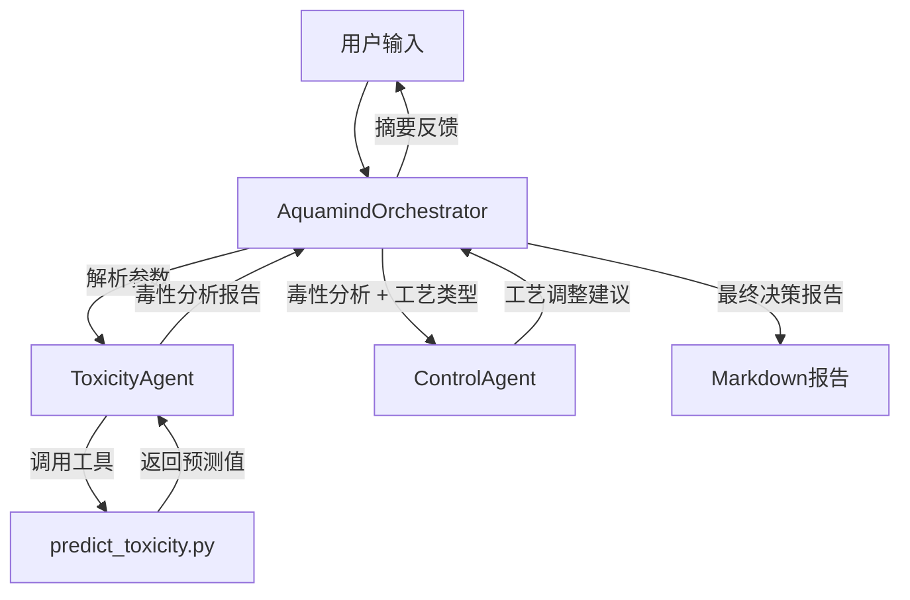

# Aquamind Systems - 智能水质预测与控制系统

## 1. 系统简介

**Aquamind Systems** 是一个基于 **LangChain** 架构构建的多智能体（Multi-Agent）系统，专为污水处理厂设计。该系统模拟了污水处理厂的运营团队，能够根据当前的水质参数和运行工艺，预测未来的水质毒性风险，并提供专业的工艺调整建议。

系统的核心理念是通过协同工作的智能体，将数据分析、毒性预测和工艺控制决策有机结合，辅助运营人员进行科学决策。

## 2. 系统架构

系统采用典型的 **Orchestrator-Workers** 模式，包含一个顶层协调者和两个功能专精的 Worker Agent。

### 2.1 核心组件

1.  **AquamindOrchestrator (协调者)**
    *   **角色**: 资深运营工程师 / 项目经理
    *   **职责**:
        *   作为用户交互的唯一入口，解析自然语言指令。
        *   识别关键上下文信息（运行工艺、预测时间范围、当前水质数据）。
        *   协调调度下游 Agent（先预测，后控制）。
        *   汇总各方输出，生成最终的决策报告。

2.  **ToxicityAgent (毒性预测专家)**
    *   **角色**: 水质分析师
    *   **职责**:
        *   调用专业的预测工具 (`predict_toxicity.py`)。
        *   基于历史数据和当前参数，预测未来（如24小时后）的水质毒性。
        *   分析预测结果，识别潜在的风险因子（如氨氮过高、pH异常等）。

3.  **ControlAgent (工艺控制专家)**
    *   **角色**: 工艺工程师
    *   **职责**:
        *   接收毒性预测报告和分析结论。
        *   结合当前的污水处理工艺（如 AAO, SBR, MBR 等）。
        *   基于内置的专家知识库（LLM），生成具体的工艺调整方案（如调整回流比、曝气量、加药量等）。

### 2.2 数据流向



## 3. 目录结构

```text
Agent/
├── Agent/                      # 智能体核心逻辑
│   ├── AquamindOrchestrator.py # 顶层协调者
│   ├── ToxicityAgent.py        # 毒性预测智能体
│   └── ControlAgent.py         # 工艺控制智能体
├── Data/                       # 数据存储
│   └── Toxicity.csv            # 历史水质毒性数据
├── Task/                       # 执行脚本与测试
│   ├── AquamindOrchestrator_task.py  # 系统主程序入口
│   ├── ToxicityAgent_task.py         # 预测功能测试
│   └── ControlAgent_task.py          # 控制建议测试
├── Tool/                       # 工具库
│   └── predict_toxicity.py     # 毒性预测算法工具
├── Report/                     # 输出报告
│   └── Report_YYYYMMDD_HHMMSS.md
├── LLM/                        # 模型接口层
│   └── llm_interface.py
├── .env                        # 配置文件 (API Key)
└── requirements.txt            # 项目依赖
```

## 4. 安装与配置

### 4.1 环境准备

确保已安装 Python 3.10+。

```bash
# 安装依赖
pip install -r requirements.txt
```

### 4.2 配置文件 (.env)

在 `Agent` 目录下创建或修改 `.env` 文件，配置模型 API 信息：

```env
# 模型配置 (支持 OpenAI 兼容接口，如 Qwen/DeepSeek 等)
QWEN_API_BASE=https://dashscope.aliyuncs.com/compatible-mode/v1
QWEN_API_KEY=your_api_key_here
QWEN_MODEL_NAME=qwen3-next-80b-a3b-instruct

# LangChain 兼容配置
OPENAI_API_BASE=https://dashscope.aliyuncs.com/compatible-mode/v1
OPENAI_API_KEY=your_api_key_here

# 模型参数
MODEL_TEMPERATURE=0.7
MODEL_MAX_TOKENS=8192
```

## 5. 使用指南

### 5.1 启动主程序

使用 `AquamindOrchestrator_task.py` 启动交互式对话：

```bash
python Agent/Task/AquamindOrchestrator_task.py
```

### 5.2 交互示例

**用户输入**:
> "你好Aquamind，我目前的运行工艺是AAO，目前水质毒性数据是氨氮25mg/L，温度20度，请你帮我预测下未来24小时后的毒性数据并给出调整方案"

**系统响应过程**:
1.  **识别**: 工艺=AAO, 时间=24小时, 关键参数=氨氮25mg/L, 温度20度。
2.  **预测**: ToxicityAgent 预测毒性风险偏高（因氨氮高），等级为“中高风险”。
3.  **建议**: ControlAgent 针对 AAO 工艺，建议增加内回流比以增强反硝化，同时注意溶解氧控制。
4.  **报告**: 生成一份包含详细数据和建议的 Markdown 报告保存在 `Report/` 目录下。

## 6. 扩展开发

*   **添加新工具**: 在 `Tool/` 目录下创建新的 Tool 类，并在 `ToxicityAgent` 中注册。
*   **支持新工艺**: 优化 `ControlAgent` 的 Prompt，增加对特定工艺的知识描述。
*   **接入真实数据源**: 修改 `predict_toxicity.py` 中的 `_load_csv_data` 方法，对接数据库或实时接口。

---
*Aquamind Systems v1.0*
