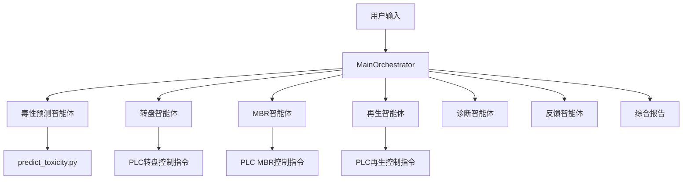

# Aquamind Systems - 智能水质预测与控制系统

## 1. 系统简介

**Aquamind Systems** 是一个基于 **LangChain** 架构构建的多智能体（Multi-Agent）系统，专为污水处理厂设计。该系统模拟了污水处理厂的运营团队，包含 **7个专业智能体**，能够根据当前的水质参数和运行工艺，预测未来的水质毒性风险，并提供专业的工艺调整建议和PLC控制指令。

## 2. 系统架构

系统采用 **Orchestrator-Workers** 模式，包含两个协调器和多个功能专精的子智能体。

### 2.1 智能体列表

| 智能体 | 角色 | 核心功能 |
|--------|------|----------|
| **MainOrchestrator** | 总协调器 | 意图识别、子智能体调度、综合报告生成 |
| **AquamindOrchestrator** | 运营工程师 | 用户交互入口，兼容旧版API |
| **ToxicityAgent** | 水质分析师 | 毒性预测、风险评估、等级判定 |
| **ControlAgent** | 工艺工程师 | 综合控制决策、子系统调度 |
| **TurntableAgent** | 转盘控制专家 | 活性炭转盘吸附反应器控制 |
| **MBRAgent** | MBR控制专家 | MBR膜生物反应器控制 |
| **RegenerationAgent** | 再生控制专家 | 活性炭再生系统控制 |
| **DiagnosticAgent** | 诊断评估专家 | 系统健康诊断、故障检测 |
| **FeedbackAgent** | 反馈分析专家 | 控制效果评估、参数优化 |

### 2.2 数据流向



## 3. 目录结构

```text
Aquamind/
├── Agent/                          # 智能体核心逻辑
│   ├── MainOrchestrator.py          # 总智能体/协调器
│   ├── AquamindOrchestrator.py      # 系统协调器(兼容旧版)
│   ├── ToxicityAgent.py             # 毒性预测智能体
│   ├── ControlAgent.py              # 工艺控制智能体
│   ├── TurntableAgent.py            # 转盘控制智能体
│   ├── MBRAgent.py                  # MBR控制智能体
│   ├── RegenerationAgent.py         # 再生控制智能体
│   ├── DiagnosticAgent.py           # 诊断评估智能体
│   ├── FeedbackAgent.py             # 反馈智能体
│   └── __init__.py
├── Knowledge/                      # 知识库模块
│   ├── knowledge_base.py            # PLC变量、设备信息、专家规则
│   └── __init__.py
├── Data/                           # 数据存储
│   └── Toxicity.csv                 # 历史水质毒性数据
├── Task/                           # 执行脚本与测试
│   ├── MainOrchestrator_task.py     # 主程序入口(推荐)
│   ├── AquamindOrchestrator_task.py # 系统主程序(兼容旧版)
│   ├── ToxicityAgent_task.py        # 毒性预测测试
│   ├── ControlAgent_task.py         # 控制建议测试
│   └── task_manager.py              # 任务管理器
├── Tool/                           # 工具库
│   └── predict_toxicity.py          # 毒性预测算法工具
├── LLM/                            # 模型接口层
│   └── llm_interface.py             # LLM统一接口
├── Report/                         # 输出报告
│   └── Report_YYYYMMDD_HHMMSS.md
├── .env                            # 配置文件 (API Key)
└── requirements.txt                # 项目依赖
```

## 4. 安装与配置

### 4.1 环境准备

确保已安装 Python 3.10+ 和 Conda。

```bash
# 激活环境
conda activate agentcl

# 安装依赖
pip install -r requirements.txt
```

### 4.2 配置文件 (.env)

在 `Aquamind` 目录下配置 `.env` 文件：

```env
# 模型配置 (支持 OpenAI 兼容接口，如 Qwen/DeepSeek 等)
QWEN_API_BASE=https://dashscope.aliyuncs.com/compatible-mode/v1
QWEN_API_KEY=your_api_key_here
QWEN_MODEL_NAME=qwen-plus

# LangChain 兼容配置
OPENAI_API_BASE=https://dashscope.aliyuncs.com/compatible-mode/v1
OPENAI_API_KEY=your_api_key_here

# 模型参数
MODEL_TEMPERATURE=0.7
MODEL_MAX_TOKENS=8192
```

## 5. 使用指南

### 5.1 启动主程序

```bash
cd Aquamind

# 方式1: 使用新版MainOrchestrator (推荐)
python Task/MainOrchestrator_task.py

# 方式2: 使用旧版AquamindOrchestrator
python Task/AquamindOrchestrator_task.py

# 演示模式
python Task/MainOrchestrator_task.py --demo

# 直接输入
python Task/MainOrchestrator_task.py --input "请帮我诊断系统状态"
```

### 5.2 支持的意图类型

| 意图 | 关键词示例 | 调度的智能体 |
|------|----------|------------|
| 毒性预测 | "预测毒性"、"氨氮多少" | ToxicityAgent |
| 转盘控制 | "转盘调整"、"频率设置" | TurntableAgent |
| MBR控制 | "MBR"、"膜压力"、"TMP" | MBRAgent |
| 再生控制 | "活性炭再生"、"饱和" | RegenerationAgent |
| 系统诊断 | "诊断"、"系统状态" | DiagnosticAgent |
| 反馈收集 | "反馈"、"建议" | FeedbackAgent |
| 综合分析 | "完整分析"、"全部" | 所有智能体 |

### 5.3 交互示例

**示例1: 毒性预测**
```
用户: 氨氮25mg/L，温度20度，请预测毒性
系统: 调度ToxicityAgent -> 返回毒性等级"中"，风险评估，建议措施
```

**示例2: 转盘控制**
```
用户: 请帮我调整转盘频率，当前毒性较高
系统: 调度TurntableAgent -> 返回推荐频率=35Hz，转速=1050rpm，启用备用线路
```

**示例3: 系统诊断**
```
用户: 请帮我诊断系统状态
系统: 调度DiagnosticAgent -> 返回整体健康=优秀(97.5分)，各子系统状态
```

### 5.4 输出结果

系统会生成综合报告保存到 `Report/` 目录，包含：
- 用户请求摘要
- 毒性预测分析
- 转盘/MBR/再生控制建议
- 系统诊断结果
- PLC控制指令

## 6. 核心功能

### 6.1 转盘控制策略

| 毒性等级 | 频率范围 | 活跃反应器 | 运行模式 |
|----------|----------|------------|----------|
| 低 (< 1.5) | 5-15 Hz | 2台 | 节能模式 |
| 中 (1.5-3.0) | 15-35 Hz | 2台 | 标准模式 |
| 高 (> 3.0) | 35-50 Hz | 3台 | 应急模式 |

### 6.2 MBR控制策略

| TMP范围 | 曝气量 | 通量 | 操作 |
|----------|---------|------|------|
| < 20 kPa | 50 m³/h | 20 LMH | 正常运行 |
| 20-30 kPa | 55 m³/h | 18 LMH | 加强监控 |
| > 30 kPa | 70 m³/h | 15 LMH | 触发反洗 |

### 6.3 再生控制策略

| 吸附效率 | 再生模式 | 炉温 | 进料速度 |
|----------|----------|------|----------|
| > 70% | 待机 | 0°C | 0 kg/h |
| < 70% | 热再生 | 800°C | 30 kg/h |

## 7. 扩展开发

### 7.1 添加新智能体

1. 在 `Agent/` 目录下创建新的Agent文件
2. 继承基本结构，实现 `__init__` 和 `generate_control_output` 方法
3. 在 `MainOrchestrator` 中注册新智能体
4. 更新 `_identify_intent` 方法添加新意图识别

### 7.2 扩展知识库

编辑 `Knowledge/knowledge_base.py` 添加：
- PLC变量定义
- 设备参数
- 专家规则

### 7.3 接入真实PLC

修改各Agent的 `to_plc_command()` 方法，对接实际的PLC通信协议。

## 8. API参考

### 8.1 ToxicityAgent

```python
from Agent.ToxicityAgent import ToxicityAgent

agent = ToxicityAgent()
result = agent.run("氨氮20mg/L，温度22度")
# 返回: {status, analysis, toxicity_level, risk_level, recommendations}
```

### 8.2 ControlAgent

```python
from Agent.ControlAgent import ControlAgent

agent = ControlAgent()
result = agent.generate_turntable_control(toxicity=2.5)
# 返回: {frequency_1, rpm_1, active_reactors, ...}
```

### 8.3 MainOrchestrator

```python
from Agent.MainOrchestrator import MainOrchestrator

orchestrator = MainOrchestrator()
report = orchestrator.run("请给我一个完整的系统分析")
# 返回: 综合报告 (Markdown格式)
```

---
*Aquamind Systems v2.0 - 您的智慧水务专家*
